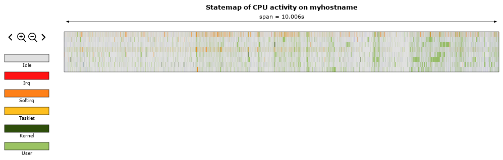

# Tool to convert perf data to state maps

This is to be used with [statemap](https://github.com/oxidecomputer/statemap),
which by default only have examples for dtrace. This repo implements a converter
from perf data to the input format expected by statemap, making it easy to use
on normal Linux systems.

## Installation

Clone this repo and build with `cargo build --release`. The resulting binary
will be in `target/release/perf-to-statemap`.

(I think this is too niche to make proper releases of and upload to crates.io,
but you could convince me otherwise.)

## Usage example

```bash
perf sched record \
    -e irq:irq_handler_entry -e irq:irq_handler_exit \
    -e irq:softirq_entry -e irq:softirq_exit \
    -e irq:tasklet_entry -e irq:tasklet_exit \
    -k CLOCK_MONOTONIC_RAW -- sleep 5
perf-to-statemap perf.data > out.json
statemap out.json > statemap.html
```

Note the use of `perf sched record` not plain `perf record`. You could also pass
the required flags to `perf record` directly.

Example output:



## Limitations

* If you want to process data from a different system, you will need to copy
  tracepoint definitions from `/sys/kernel/tracing` on that system. See
  the `--sysroot` option for more details.
* You need read access to the tracepoint format definitions in
  `/sys/kernel/tracing`. This is not the default for non-root.
